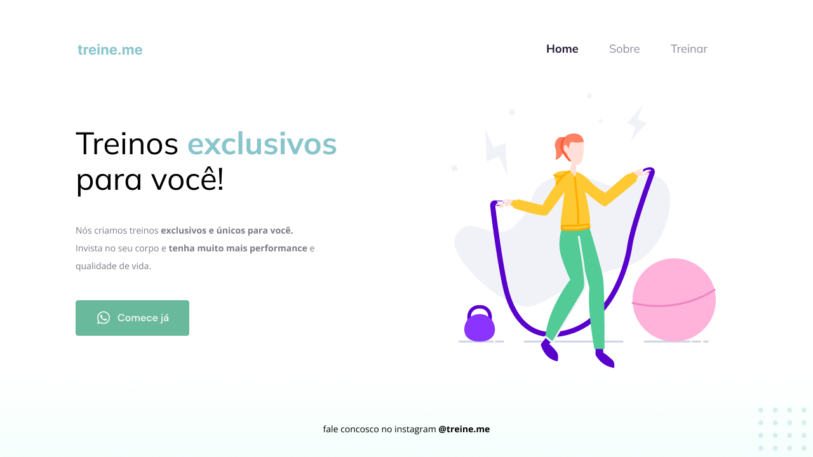

<div align="center">
  
  <h2 align="center">treine.me</h2>

</div>

<br />

### Demo Screeshots



### About

Project developed during stage 2 - Introduction to HTML and CSS, in [Rocketseat](https://github.com/Rocketseat) explorer course.  

Learned concepts:

- Structuring HTML with semantic tags;

- The CSS Box Model concept;

- The CSS Flexbox concept;

- Refactoring;

- Adding fonts and improving text;

- Applying alignment and spacing to main and footer;

- Setting up the button

- Linear-gradient background and final adjustments

### Prerequisites

Before you begin, ensure you have met the following requirements:

- [Git](https://git-scm.com/downloads "Download Git") must be installed on your operating system.

### Run Locally

To run **treine.me** locally, run this command on your git bash:

Linux and macOS:

```bash
sudo git clone https://github.com/denilsonbaptista/moveis-customizados.git
```

Windows:

```bash
git clone https://github.com/denilsonbaptista/moveis-customizados.git
```

### Contact

If you want to contact with me you can reach me at [Linkedin](https://www.linkedin.com/in/denilsonbaptista/).

### License

This project is **free to use** and does not contains any license.